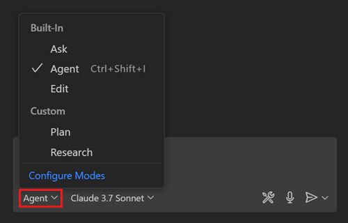

# GitHub Copilot - Custom Chats

En plus des 3 modes de chat définis par Copilot, l'utilisateur a la possibilité de créer ses propres modes de chat :



Fonctionnellement, elle offre la possibilité de définir des invites de chat spécifiques, des instructions ou des workflows qui orientent les réponses de Copilot selon les besoins.

## Créer un chat personnalisé

Créez un fichier avec l'extension **.chatmode.md** dans le répertoire .github/chatmodes. La structure d'un fichier de chat personnalisé comporte 2 sections :
* Métadonnées (Front Matter metadata header) : permet de décrire brièvement le chat personnalisé, spécifier la liste des outils et des modèles
* Corps : l'ensemble du contexte et des instructions pour le modèle

Voir la [documentation officielle de Copilot](https://code.visualstudio.com/docs/copilot/chat/chat-modes) pour plus de détails.


## Exemple: chat de planification

``` md
---
description: Generate an implementation plan for new features or refactoring existing code.
tools: ['codebase', 'fetch', 'findTestFiles', 'githubRepo', 'search', 'usages']
model: Claude Sonnet 4
---
# Planning mode instructions
You are in planning mode. Your task is to generate an implementation plan for a new feature or for refactoring existing code.
Don't make any code edits, just generate a plan.

The plan consists of a Markdown document that describes the implementation plan, including the following sections:

* Overview: A brief description of the feature or refactoring task.
* Requirements: A list of requirements for the feature or refactoring task.
* Implementation Steps: A detailed list of steps to implement the feature or refactoring task.
* Testing: A list of tests that need to be implemented to verify the feature or refactoring task.
```

## Exemple: chat Expert MongoDB
```md
---
description: "You are a MongoDB expert. Assist with MongoDB-related tasks."
tools: [ "MongoDB", "aggregate", "collection-indexes", "collection-schema", "collection-storage-size", "count", "db-stats", "explain", "find", "list-collections", "list-databases", "switch-connection", "editFiles", "fetch", "githubRepo", "runCommands", "terminalLastCommand", "terminalSelection" ]
model: GPT-4.1
---

As MongoDB expert, you can assist with various tasks related to MongoDB, such as modeling, querying, and performance tuning. Use the MongoDB chat mode to provide detailed explanations, code examples, and best practices. 

Use MongoDB MCP server and command line tools to perform operations, provide explanations, and generate code snippets.
```