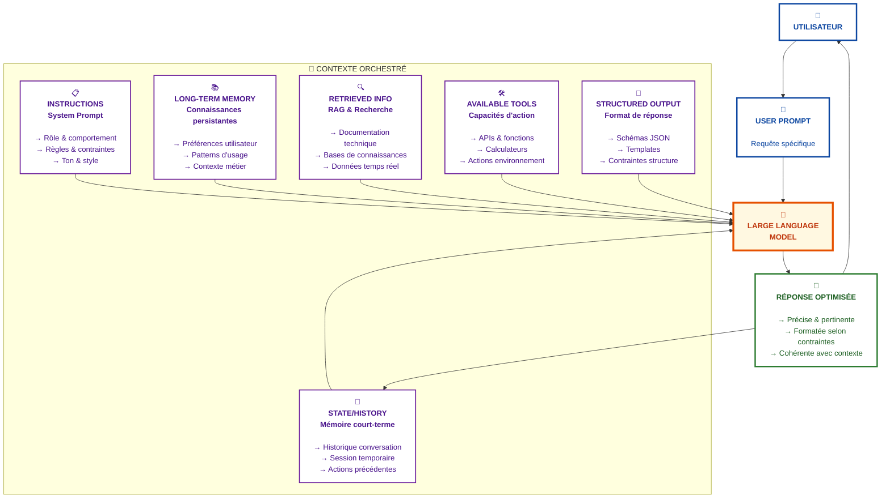

# Qu'est-ce que le Context Engineering ?

## 🎯 En une phrase

Le **Context Engineering** est l'art de concevoir et structurer les informations fournies aux LLMs pour maximiser la qualité, la précision et la pertinence de leurs réponses.

## 🤔 Pourquoi c'est crucial ?

Imaginez la différence entre :
- ❌ "Écris du code pour une API"
- ✅ "Écris une API REST en Python avec FastAPI, suivant les conventions de notre entreprise (voir ci-joint), avec authentification JWT et gestion d'erreurs standardisée"

La différence de résultat est **spectaculaire**. C'est ça, le Context Engineering.

## 🎭 Pour qui ?

### Développeurs d'applications avec LLMs
- Optimisez vos prompts pour des résultats cohérents
- Réduisez les allers-retours et le temps de développement
- Créez des templates réutilisables pour votre équipe

### Product Owners & Chefs de projet
- Comprenez les capacités et limites réelles des LLMs
- Estimez mieux les coûts et délais de vos projets IA
- Définissez des spécifications adaptées aux systèmes d'agents

### Architectes de systèmes agentiques
- Concevez des flux de contexte efficaces entre agents
- Optimisez la consommation de tokens
- Garantissez la cohérence des outputs à grande échelle

## 🔑 Les principes fondamentaux

### 1. **Le contexte est ROI**
Plus votre contexte est riche et structuré, meilleur sera le résultat. Un LLM sans contexte, c'est comme un développeur junior sans documentation.

### 2. **La spécificité paie**
Chaque détail compte :
- Conventions de nommage
- Structure de projet
- Contraintes techniques
- Exemples concrets

### 3. **La réutilisabilité**
Les meilleurs contextes sont :
- Modulaires
- Versionnés
- Testables
- Partageables

## 🧩 Les composants du contexte

> *"Le contexte est un système, pas une simple chaîne de caractères"* — Phil Schmid

Le Context Engineering va bien au-delà du prompt traditionnel. Il orchestre **6 composants essentiels** :



### 📋 **Instructions / System Prompt**
- Définissent le rôle et comportement de l'IA
- Spécifient les règles et contraintes générales
- Établissent le ton et style de communication

### 💬 **User Prompt**
- La requête spécifique de l'utilisateur
- Le déclencheur de l'interaction
- Peut contenir des exemples et du contexte immédiat

### 🧠 **State / History (Mémoire court-terme)**
- Historique de conversation actuelle
- Contexte de session temporaire
- Suivi des actions précédentes dans le workflow

### 📚 **Long-Term Memory**
- Connaissances persistantes sur l'utilisateur/projet
- Préférences et patterns d'usage
- Contexte métier spécialisé

### 🔍 **Retrieved Information (RAG)**
- Informations externes récupérées dynamiquement
- Documentation technique, bases de connaissances
- Données contextuelles en temps réel

### 🛠️ **Available Tools**
- Outils et fonctions accessibles à l'IA
- APIs, calculateurs, générateurs de code
- Capacités d'action sur l'environnement

### 📄 **Structured Output**
- Format de réponse attendu
- Schémas JSON, templates, contraintes de structure
- Cohérence et prévisibilité des résultats

> 💡 **Insight clé** : *"Les échecs d'agents ne sont pas seulement des échecs de modèle ; ce sont des échecs de contexte"*

## 💡 Exemple concret

```markdown
# Contexte AVANT (❌ Résultat imprévisible)
Crée une fonction pour valider des emails

# Contexte APRÈS (✅ Résultat professionnel)
## Contexte
- Language: TypeScript
- Framework: NestJS
- Standards: ISO email validation
- Gestion d'erreurs: Exceptions custom

## Contraintes
- Performance: < 10ms par validation
- Sécurité: Protection contre ReDoS
- i18n: Messages d'erreur multilingues

## Exemple attendu
@Injectable()
export class EmailValidator {
  validate(email: string): ValidationResult {
    // Implementation avec regex optimisée
  }
}
```

## 🚀 Les bénéfices immédiats

1. **Gain de temps** : -70% d'itérations pour obtenir le bon résultat
2. **Qualité constante** : Outputs prévisibles et maintenables
3. **Scalabilité** : Templates réutilisables pour toute l'équipe
4. **Coût optimisé** : Moins de tokens consommés grâce à la précision

## 🎓 Par où commencer ?

### Niveau 1 : Les bases
- [Structurer ses prompts](./prompt-structure.md) 🚧
- [Les patterns essentiels](./essential-patterns.md) 🚧
- [Gérer les hallucinations](./managing-hallucinations.md) 🚧

### Niveau 2 : Optimisation par outil
- [Claude : Maximiser les Projects](../agents/claude/README.md) 🚧
- [Cursor : Rules et .cursorrules](../agents/cursor/README.md) 🚧
- [GitHub Copilot : Context efficace](../agents/github-copilot/README.md) 🚧

### Niveau 3 : Frameworks avancés
- [BMAD-METHOD : Framework universel](../frameworks/bmad-method/README.md) 🚧
- [SuperClaude : Pour Claude](../frameworks/superclaude/README.md) 🚧
- [Cursor Rules : Pour Cursor](../frameworks/cursor-rules/README.md) 🚧

## 🔥 Le Context Engineering n'est pas...

- ❌ **Du prompt engineering basique** : On va bien au-delà du "sois créatif"
- ❌ **De la magie** : C'est une discipline avec des patterns reproductibles
- ❌ **Optionnel** : C'est la différence entre un POC et un produit en production
- ❌ **Figé** : Les techniques évoluent avec chaque nouvelle version des LLMs

## 📊 ROI typique

| Sans Context Engineering | Avec Context Engineering |
|-------------------------|-------------------------|
| 10-15 itérations | 2-3 itérations |
| Output variable | Output prévisible |
| Maintenance difficile | Templates versionnés |
| Coût élevé en tokens | Consommation optimisée |
| Onboarding complexe | Documentation intégrée |

## 🎯 Votre prochaine étape

1. **Explorez** les [exemples concrets](../examples/README.md) 🚧
2. **Choisissez** votre outil principal (Claude, Cursor, Copilot...)
3. **Appliquez** un framework adapté à vos besoins
4. **Mesurez** l'impact sur votre productivité

---

> 💬 *"Un LLM sans contexte, c'est comme un GPS sans carte. Le Context Engineering, c'est votre cartographie vers l'excellence."*

**Prêt à transformer votre façon de travailler avec les LLMs ?** 

Plongez dans nos guides spécialisés et découvrez comment les équipes les plus performantes utilisent le Context Engineering pour révolutionner leur productivité.